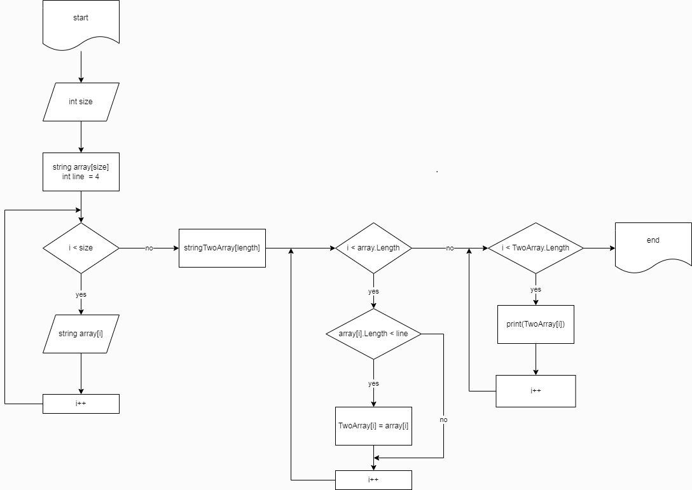

Написать программу, которая из имеющегося массива строк формирует массив из строк,
 длина которых меньше, либо равна 3 символам. Первоначальный массив можно ввести с клавиатуры, 
 либо задать на старте выполнения алгоритма. При решении не рекомендуется пользоваться коллекциями,
 лучше обойтись исключительно массивами.

["hello", "2", "world", ":-)"] -> ["2", ":-)"]

["1234", "1567", "-2", "computer science"] -> ["-2"]

["Russia", "Denmark", "Kazan"] -> []

## *Алгоритм:*

Создаем блок-схему при помощи app.diagrams.net

У пользователя спрашиваем размер массива. Получаем ответ от него и приступаем к выполнению задачи. 
Создаем первый метод, где у пользователя спрашиваем еллементы массива и выводим их в консоль. Даем право пользователю ввести все эллементы.

Когда все эллементы введены пользователем, приступаем к написанию метода, чтобы его показать. т.к. у нас условие задачи создать второй массив с эллементами не превышающими колличество 3, мы вводим ограничение, что если эллемент пустой, то не выводить его в консоль.

Следом создаем еще один метод, при помощи которого выясняем какая длинна у каждого эллемента и меньше ли она (или равна) 3(так же как в условии). Перед этим циклом создаем еще один массив и у же в него записываем полученный результат и выводим пользователю на экран.

